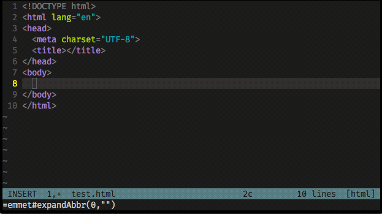
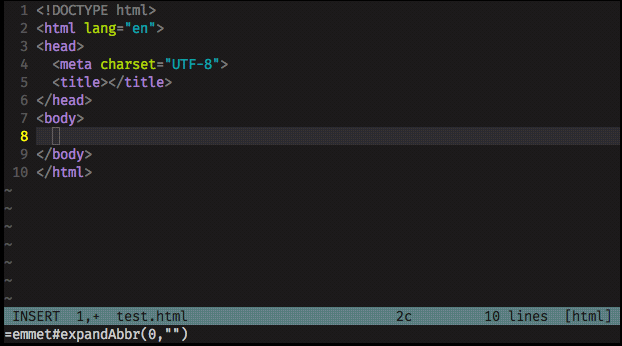
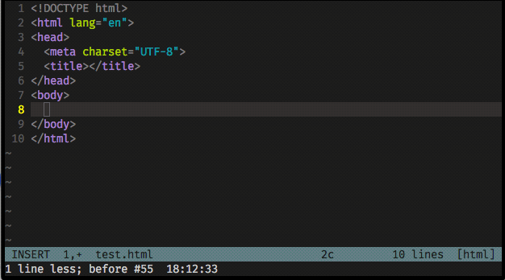

# neovim config guide
this is my neovim config for Python/Django and Javascript development.

you can install this config file by cloning the repo and installing the dependency (you can see it in Installation part).

also you can see shortcuts and plugin config after Installation part.

## Installation
1. neovim
    - ubuntu:
        ```bash 
        sudo apt install neovim
        ```
    - Arch:
        ```bash 
        sudo pacman -S neovim
        ```
---
2. vim-plug (plugin manager):
 ```bash 
curl -fLo ~/.config/nvim/autoload/plug.vim --create-dirs https://raw.githubusercontent.com/junegunn/vim-plug/master/plug.vim
```
3. xsel
    - Ubuntu:
        ```bash
        sudo apt install xsel
        ```
      - Arch:
      ```bash
      sudo pacman -S xsel
      ```
---
4. npm :
      - Ubuntu:
        ```bash
        curl -fsSL https://deb.nodesource.com/setup_16.x | sudo -E bash -
        sudo apt-get install -y nodejs
        ```
      - Arch:
        ```bash
        pacman -S nodejs npm
        ```
---
5. neovim python and node support
```bash
pip install pynvim
npm i -g neovim
```
---
6. Ranger

    - Ubuntu
    ```bash
    sudo apt install ranger
    ```

    - Arch
    ```bash
    sudo pacman -S ranger
    ```

install ranger devicons:
```bash
git clone https://github.com/alexanderjeurissen/ranger_devicons ~/.config/ranger/plugins/ranger_devicons
```
**_You can now add default_linemode devicons to your rc.conf_**

+ **Install Ueberzug(use for preview images in ranger)**:
    - Ubuntu(Note you may experience your images being badly placed this is because pip doesn't have the newest version of ueberzug, if you find this issue please install from source)
        ```bash
            pip install ueberzug
        ```
    - Arch
        ```bash
            yay -S python-ueberzug-git
        ```

Ranger config file:
make sure you create a ranger config file and at least add the following lines
```bash
mkdir ~/.config/ranger

touch ~/.config/ranger/rc.conf
```

Add this configuration to rc.conf

```bash
set preview_images_method ueberzug

default_linemode devicons

set show_hidden true
```

7. fzf
    - Ubuntu:
    ```bash
    sudo apt install fzf
    ```
    -Arch
    ```bash
    sudo pacman -S fzf
    ```

## general shortcuts
Use alt + hjkl to resize windows

Use ctrl + hjkl to navigate windows

user ctrl+u over word for make it Uppercase

TAB in general mode will move to next buffer SHIFT-TAB will go back

alternative save&quit :
   - Use ctrl+s => save (:w) 
   - ctrl+Q save and quite(:wq!)

Use control-c instead of escape


## Extenction config
### lsp
Recently I switch lsp over coc, and here is some shortcuts and configuration of my lsp.

`gd`  go to definition.

`gD`  go to declaration.

`gr`  go to references.

`gi`  go to implementation.

`K`   Hover and show more additional information.

`C-n` go to next diagnostic.

`C-p` go to previous diagnostic.

also auto formate is active for '.py' '.js' '.jsx' files

---

### Emmet

my command to trigger the Emmet’s magic is: `,,` (comma comma) , simple and close to the fingers!

examples:

type `html:5` in INSERT mode then press comma two time `,,` like this gif


also you can create tags like `div` or custome tag like `myname` like this gif


let’s add a `<div>` with a `<p>` inside, that contains a link `<a href="">` for this example we use `>` operator so just type `div>p>a` and `,,` see this gif


You can define html attributes to the elements using the same convention used by CSS.

Let’s try with the previous example, adding a `.container` class to the `<div>`, a `#foo` id to the `<p>` tag.
type `div.container>p#foo>a` and `,,`


Let’s say you want a <div> with 5 `<p>` inside of it, just go with `div>p*5`:


also if you want more information check this [link](https://github.com/mattn/emmet-vim).

---

### MarkdownPreview
I use markdown-preview plugin for preview markdown in neovim and it's work really well.

use `:MarkdownPreview` or `Space-p` to see the preview in your default browser.

more information about [markdown-preview plugin](https://github.com/iamcco/markdown-preview.nvim
).

---

### FZF
FZF is awesome tool for use inside neovim and It's much much more faster than ranger and coc-explorer. here is shortcuts and fzf commands.

* use `leader-f` to open `:Files` where you can search for your files.
* `leader-b` or `:Buffers` for search in your open buffer.
* `leader-g` or `:Rg` search for mach result in files content and file name.
* `leader-t` or `:Tags` search for Tags
* `leader-m` or `:Marks` search for marks

also you can open files in split or new tab.
* tab split : `ctrl-t`
* split     : `ctrl-x`
* vsplit    : `ctrl-v`


## TODO
- [ ] fix signify conflit with line number
- [ ] make the shortcuts guide cleaner 
- [ ] add git integration
- [ ] create bash script to automate the installation
- [x] add more information about emmet plugin
- [x] add markdown preview to nvim
